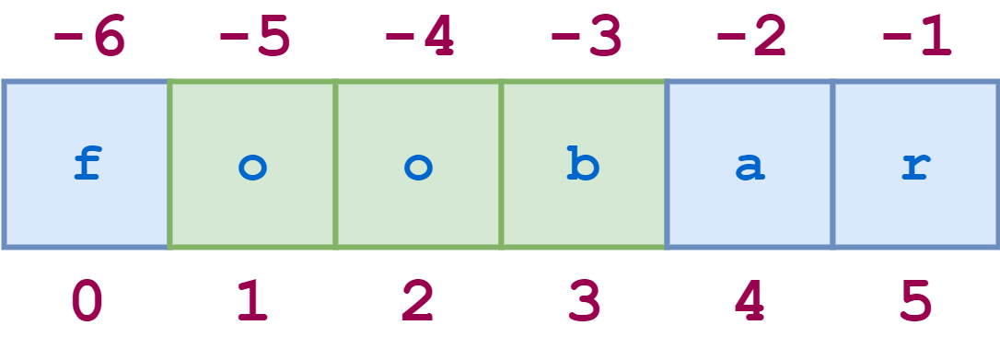

# Strings and Character Data in Python

## The * Operator
The `*` operator creates multiple copies of a string. If `s` is a string and `n` is an integer, either of the following expressions returns a string consisting of `n` concatenated copies of `s`:The  `*`  operator creates multiple copies of a string. If  `s`  is a string and  `n`  is an integer, either of the following expressions returns a string consisting of  `n`  concatenated copies of  `s`:

> `s * n`  
> `n * s`

Here are examples of both forms:

```python
>>> s = 'foo.'

>>> s * 4
'foo.foo.foo.foo.'
>>> 4 * s
'foo.foo.foo.foo.'
```


The multiplier operand `n` must be an integer. You’d think it would be required to be a positive integer, but amusingly, it can be zero or negative, in which case the result is an empty string:
```python
>>> 'foo' * -8
''
```


## String Slicing
Python also allows a form of indexing syntax that extracts [substrings](https://realpython.com/python-string-contains-substring/) from a string, known as string slicing. If `s` is a string, an expression of the form `s[m:n]` returns the portion of `s` starting with position `m`, and up to but not including position `n`:
```python
>>> s = 'foobar'
>>> s[2:5]
'oba'
```

**Remember:** String indices are zero-based. The first character in a string has index `0`. This applies to both standard indexing and slicing.

Again, the second index specifies the first character that is not included in the result—the character  `'r'`  (`s[5]`) in the example above. That may seem slightly unintuitive, but it produces this result which makes sense: the expression  `s[m:n]`  will return a substring that is  `n - m`  characters in length, in this case,  `5 - 2 = 3`.

If you omit the first index, the slice starts at the beginning of the string. Thus,  `s[:m]`  and  `s[0:m]`  are equivalent:

```python
>>> s = 'foobar'

>>> s[:4]
'foob'
>>> s[0:4]
'foob'
```


Similarly, if you omit the second index as in `s[n:]`, the slice extends from the first index through the end of the string. This is a nice, concise alternative to the more cumbersome `s[n:len(s)]`:
```python
>>> s = 'foobar'

>>> s[2:]
'obar'
>>> s[2:len(s)]
'obar'
```

For any string `s` and any integer `n` (`0 ≤ n ≤ len(s)`), `s[:n] + s[n:]` will be equal to `s`:
```python
>>> s = 'foobar'

>>> s[:4] + s[4:]
'foobar'
>>> s[:4] + s[4:] == s
True
```

Omitting both indices returns the original string, in its entirety. Literally. It’s not a copy, it’s a reference to the original string:
```python
>>> s = 'foobar'
>>> t = s[:]
>>> id(s)
59598496
>>> id(t)
59598496
>>> s is t
True
```

If the first index in a slice is greater than or equal to the second index, Python returns an empty string. This is yet another obfuscated way to generate an empty string, in case you were looking for one:
```python
>>> s[2:2]
''
>>> s[4:2]
''
```

Negative indices can be used with slicing as well. `-1` refers to the last character, `-2` the second-to-last, and so on, just as with simple indexing. The diagram below shows how to slice the substring `'oob'` from the string `'foobar'` using both positive and negative indices:


Here is the corresponding Python code:
```python
>>> s = 'foobar'

>>> s[-5:-2]
'oob'
>>> s[1:4]
'oob'
>>> s[-5:-2] == s[1:4]
True
```

## Specifying a Stride in a String Slice

There is one more variant of the slicing syntax to discuss. Adding an additional  `:`  and a third index designates a stride (also called a step), which indicates how many characters to jump after retrieving each character in the slice.

For example, for the string  `'foobar'`, the slice  `0:6:2`  starts with the first character and ends with the last character (the whole string), and every second character is skipped.


Similarly, `1:6:2` specifies a slice starting with the second character (index `1`) and ending with the last character, and again the stride value `2` causes every other character to be skipped:
```python
>>> s = 'foobar'

>>> s[0:6:2]
'foa'

>>> s[1:6:2]
'obr'
```

As with any slicing, the first and second indices can be omitted, and default to the first and last characters respectively:
```python
>>> s = '12345' * 5
>>> s
'1234512345123451234512345'
>>> s[::5]
'11111'
>>> s[4::5]
'55555'
```

You can specify a negative stride value as well, in which case Python steps backward through the string. In that case, the starting/first index should be greater than the ending/second index:
```python
>>> s = 'foobar'
>>> s[5:0:-2]
'rbo'
```

In the above example,  `5:0:-2`  means “start at the last character and step backward by  `2`, up to but not including the first character.”

When you are stepping backward, if the first and second indices are omitted, the defaults are reversed in an intuitive way: the first index defaults to the end of the string, and the second index defaults to the beginning. Here is an example:

```python
>>> s = '12345' * 5
>>> s
'1234512345123451234512345'
>>> s[::-5]
'55555'
```


This is a common paradigm for reversing a string:
```python
>>> s = 'If Comrade Napoleon says it, it must be right.'
>>> s[::-1]
'.thgir eb tsum ti ,ti syas noelopaN edarmoC fI'
```


## Interpolating Variables Into a String --- f-string

f-string:

-   Specify either a lowercase  `f`  or uppercase  `F`  directly before the opening quote of the string literal. This tells Python it is an f-string instead of a standard string.
-   Specify any variables to be interpolated in curly braces (`{}`).

```python
>>> n = 20
>>> m = 25
>>> prod = n * m
>>> print(f'The product of {n} and {m} is {prod}')
The product of 20 and 25 is 500
```

Any of Python’s three quoting mechanisms can be used to define an f-string:
```python
>>> var = 'Bark'

>>> print(f'A dog says {var}!')
A dog says Bark!
>>> print(f"A dog says {var}!")
A dog says Bark!
>>> print(f'''A dog says {var}!''')
A dog says Bark!
```


## Modifying Strings
Strings are one of the data types Python considers [immutable](https://realpython.com/python-mutable-vs-immutable-types/#immutable-built-in-data-types-in-python), meaning not able to be changed.

## Built-in String Methods
### Case Conversion
`s.capitalize()`

> Capitalizes the target string.

`s.capitalize()`  returns a copy of  `s`  with the first character converted to uppercase and all other characters converted to lowercase:
```python
>>> s = 'foO BaR BAZ quX'
>>> s.capitalize()
'Foo bar baz qux'
```

Non-alphabetic characters are unchanged:
```python
>>> s = 'foo123#BAR#.'
>>> s.capitalize()
'Foo123#bar#.'
```

s.lower()

s.swapcase()

s.title()

s.upper()

### Find and Replace

`s.count(<sub>[, <start>[, <end>]])`

> Counts occurrences of a substring in the target string.

`s.count(<sub>)`  returns the number of non-overlapping occurrences of substring  `<sub>`  in  `s`:
```python
>>> 'foo goo moo'.count('oo')
3
```

The count is restricted to the number of occurrences within the substring indicated by `<start>` and `<end>`, if they are specified:
```python
>>> 'foo goo moo'.count('oo', 0, 8)
2
```

`s.endswith(<suffix>[, <start>[, <end>]])`

> Determines whether the target string ends with a given substring.

`s.endswith(<suffix>)`  returns  `True`  if  `s`  ends with the specified  `<suffix>`  and  `False`  otherwise:
```python
>>> 'foobar'.endswith('bar')
True
>>> 'foobar'.endswith('baz')
False
```

The comparison is restricted to the substring indicated by `<start>` and `<end>`, if they are specified:
```python
>>> 'foobar'.endswith('oob', 0, 4)
True
>>> 'foobar'.endswith('oob', 2, 4)
False
```

`s.find(<sub>[, <start>[, <end>]])`

> Searches the target string for a given substring.

You can use  `.find()`  to see if a Python string contains a particular substring.  `s.find(<sub>)`  returns the lowest index in  `s`  where substring  `<sub>`  is found:

```python
>>> 'foo bar foo baz foo qux'.find('foo')
0
```

This method returns  `-1`  if the specified substring is not found:

```python
>>> 'foo bar foo baz foo qux'.find('grault')
-1
```
The search is restricted to the substring indicated by  `<start>`  and  `<end>`, if they are specified:

```python
>>> 'foo bar foo baz foo qux'.find('foo', 4)
8
>>> 'foo bar foo baz foo qux'.find('foo', 4, 7)
-1
```
`s.index(<sub>[, <start>[, <end>]])`

> Searches the target string for a given substring.

This method is identical to  `.find()`, except that it raises an exception if  `<sub>`  is not found rather than returning  `-1`:

```python
>>> 'foo bar foo baz foo qux'.index('grault')
Traceback (most recent call last):
  File "<pyshell#0>", line 1, in <module>
  'foo bar foo baz foo qux'.index('grault')
ValueError: substring not found
```
`s.rfind(<sub>[, <start>[, <end>]])`

> Searches the target string for a given substring starting at the end.

`s.rfind(<sub>)`  returns the highest index in  `s`  where substring  `<sub>`  is found:

```python
>>> 'foo bar foo baz foo qux'.rfind('foo')
16
```
As with  `.find()`, if the substring is not found,  `-1`  is returned:

```python
>>> 'foo bar foo baz foo qux'.rfind('grault')
-1
```
The search is restricted to the substring indicated by  `<start>`  and  `<end>`, if they are specified:

```python
>>> 'foo bar foo baz foo qux'.rfind('foo', 0, 14)
8
>>> 'foo bar foo baz foo qux'.rfind('foo', 10, 14)
-1
```

`s.rindex(<sub>[, <start>[, <end>]])`

> Searches the target string for a given substring starting at the end.

This method is identical to  `.rfind()`, except that it raises an exception if  `<sub>`  is not found rather than returning  `-1`:

```python
>>> 'foo bar foo baz foo qux'.rindex('grault')
Traceback (most recent call last):
  File "<pyshell#1>", line 1, in <module>
  'foo bar foo baz foo qux'.rindex('grault')
ValueError: substring not found
```
`s.startswith(<prefix>[, <start>[, <end>]])`

> Determines whether the target string starts with a given substring.

When you use the Python  `.startswith()`  method,  `s.startswith(<suffix>)`  returns  `True`  if  `s`  starts with the specified  `<suffix>`  and  `False`  otherwise:

```python
>>> 'foobar'.startswith('foo')
True
>>> 'foobar'.startswith('bar')
False
```
The comparison is restricted to the substring indicated by  `<start>`  and  `<end>`, if they are specified:

```python
>>> 'foobar'.startswith('bar', 3)
True
>>> 'foobar'.startswith('bar', 3, 2)
False
```

### Character Classification


# Reference
[RealPython.com - python-strings](https://realpython.com/python-strings/)
