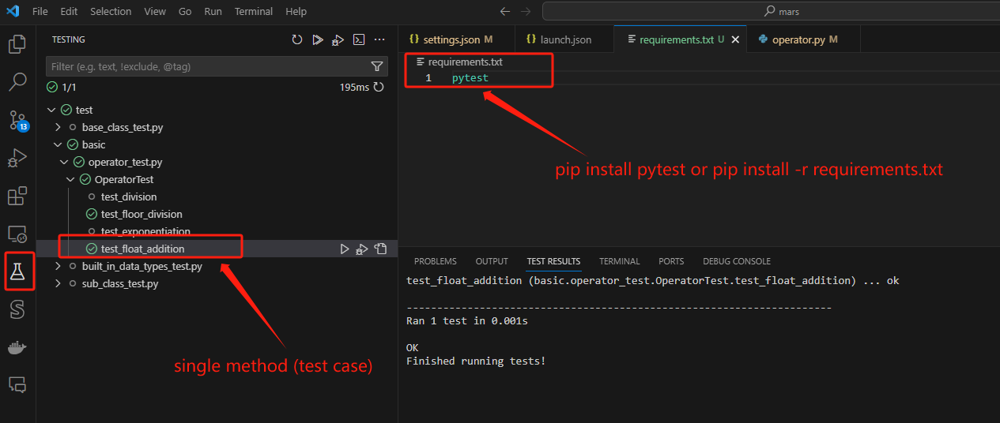

# VSCode Environment Setup

## Run and Debug
** Open each root folder under `code` separately; each root folder will be an individual workspace
** Create venv under each individual workspace

## Run unittest cases in VSCode
 - Install pytest 
	 - pip install -r requirements.txt
		 
	 - Re-launch VSCode
	 
- virtual environment might need recreate when VSCode was re-launched
